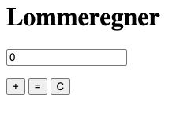

# Programmering i Javascript

## Intro

Opret en mappe ved navn `module_3` i dit projekt og opret en javascript-fil ved med navn `main.js`. Denne fil kan du bruge til at lege med de basale ting i Javascript, som bliver introduceret nedenfor.

`main.js` kan til at begynde med indeholde følgende kode:

```javascript
// Printer en besked til loggen
console.log("Hello World!");
```

I en terminal kan du køre programmet med:

```
// node {stien til filen}. Så hvis der ligger en fil med navn `main.js` i mappen `module_3`:
node module_3/main.js
```

Den skulle gerne printe "Hello World!" 😀

### Variabler

#### const

Med `const` erklærer man variabler som IKKE kan overskrives.

```javascript
const textVar = "This is a text";
const numericVar = 132342;

console.log(textVar); // Logs: "This is a text"
console.log(numericVar); // Logs: 132342

// Vil fejle fordi `textVar` er erklæret med `const`
textVar = "tried to overwrite";
```

#### let

Med `let` erklærer man variabler som KAN overskrives.

```javascript
let text2 = "this is a text"; // Kan overskrives pga. "let"
let number2 = 3.9; // Kan overskrives pga. "let"

console.log(text2); // Logs: "this is a text"
console.log(number2); // Logs: 3.9
```

Man kan mutere (dvs. ændre eller overskrive) variabler som er erklæret med `let`.

```javascript
text2 = "A different text";
console.log(text2); // Logs: "A different text"

number2 = 3000;
console.log(number2); // Logs: 3000

// Sæt to tekster (strings) sammen
const anotherString = text2 + "noget andet tekst";
```

Man kan også skifte imellem typerne:

```javascript
// Fra number til string
const aNumber = 42;
const aString = "" + aNumber; // = "42"

// Fra string til number
const aString = "42";
const aNumber = parseInt(aString); // = 42
```

#### Lidt om typer

`string`: er tekst (eller tekststreng) og skrives som "dette er en tekst", 'dette er en tekst' eller \`dette er en tekst\`

`number`: F.eks. 4399 eller -5.1

`array`: er lister med indhold. Indholdet kan være af alle slags typer. Fx:

```javascript
const a = []; // tom liste med lægden 0
const b = [3, 42]; // liste med tallene 3 og 42
const c = ["en tekst", 21, []]; // en liste med en tekst, et tal og en liste.
```

##### Arrays

Arrays er smarte til at samle andet indhold og bruges hele tiden i Javascript-programmering.

Hvert element i et array har et indeks, således at der første element har indeks `0`, det næste har indeks `1` osv. Man kan tilgå et hvilket som helst element via dette indeks. Eksempel:

```javascript
const liste = [10, 20, 30];
const a = liste[0]; // 10
const b = liste[1]; // 20
const c = liste[2]; // 30
```

Man kan ændre en værdi i array'et via et indeks:

```javascript
const liste = [10, 20, 30];
liste[2] = 40; // nu indeholder `liste`: [10, 20, 40]
```

... eller tilføje og fjerne elementer:

```javascript
const colors = ["red"];

// tilføj et element
colors.push("blue"); // colors er nu: ["red", "blue"]

// fjern et element
colors.pop(); // colors er nu: ["red"] igen
```

Man kan også iterere (gennemløbe) et array:

```javascript
const liste = [10, 20, 30];

// med en for-løkke (engelsk: for loop)
for (let i = 0; i < liste.length; i++) {
  console.log(liste[i]);
}

// eller fx med `forEach`-metoden:
liste.forEach(function (item) {
  console.log(item);
});
```

### Funktioner

```javascript
// En funktion som ikke tager nogen parametre eller returnerer noget:
function sayHello() {
  console.log("Hello");
}

// En funktion som tager en parameter ("name") of returnerer ikke noget:
function sayHelloTo(name) {
  console.log("Hello " + name);
}

sayHello();
sayHelloTo("John");
```

```javascript
// Funktionen tager to parametre
function addNumbers(a, b) {
  return a + b;
}
const result = addNumbers(9, 3);
console.log(result); // Logs: 12
```

Alternativt kan man skrive funktioner som "arrow functions":

```javascript
const subtractNumbers = (a, b) => {
  return a - b;
};

const result = subtractNumbers(10, 3);
console.log(result); // Logs: 7
```

## Lommeregner

Nu skal vi prøve at sætte lidt af det vi har lært sammen til en lille web-app, nemlig en lille lommeregner.



Start med at lave følgende filer i din `module_3`-mappe:

- `index.html`
- `calculator.js`

index.html:

```html
<!DOCTYPE html>
<html lang="en">
  <head>
    <meta charset="UTF-8" />
    <meta name="viewport" content="width=device-width, initial-scale=1.0" />
    <title>Lommeregner</title>
  </head>
  <body>
    <!-- Her skal vi skrive din HTML-kode -->
    <script src="/calculator.js"></script>
  </body>
</html>
```

calculator.js:

```javascript
console.log("hello world");
```

Prøv at køre det i din terminal med kommandoen:

```
npx http-server module_3/solution -o -p 9999
```

og åben `http://127.0.0.1:9999/` i din browser. Siden er tom, men du skal kunne se "hello world" i konsollen.

### Interaktion med knapper i HTML

Tilføj en knap indeni `body` i din `index.html`-fil, som har et ID:

```html
<button id="knap-1">Knap 1</button>
```

Tilføj lidt javascript til `calculator.js` og se hvad der sker, når du klikker på "Knap 1".

```javascript
// Gem en reference til knappen i en variabel
const myButton = document.getElementById("knap-1");

// Lav en funktion til at håndtere hver gang der klikkes på knappen:
function clickHandler() {
  console.log("Der blev klikket på knappen!");
}

// Tilløj en "event listener" til din `myButton`, som lytter på "click"-events og kalder din `clickHandler`
myButton.addEventListener("click", clickHandler);
```

### Interaktion med input i HTML

Tilføj et input element indeni `body` i din `index.html`-fil, som har et ID:

```html
<input id="input-1" value="0" />
```

I `calculator.js` tilføjes:

```javascript
// Gem en reference til input-feltet i en variabel
const myInput = document.getElementById("input-1");

// Lav en funktion til at håndtere hver gang der sker ændringer i input-feltet
function handleChanges(event) {
  console.log(event.target.value);
}

// Tilløj en "event listener" til din `myInput` (kaldes kun når input forlades)
myInput.addEventListener("change", handleChanges);
```

## Forslag til ekstraopgaver

- Lav en ny underside til hjemmesiden fra "module_1" og "module_2" med din lommeregner.
- Lav et klassisk "num pad" med tallene 0 til 9 og brug dem til at indsætte værdier i inputfeltet.
- tilføj en "minus"-knap, så lommeregneren kan trække tal fra.
